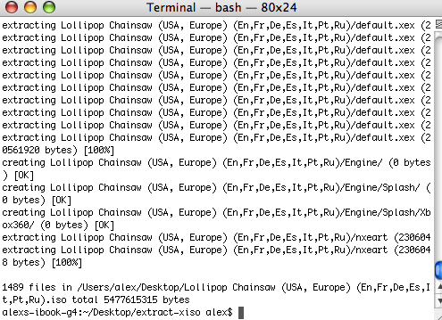

# Nextract Xiso (NXISO)

_By Alex Free_



A portable open source program for the creation, modification, and extraction of [XISOs](https://consolemods.org/wiki/Xbox:Playing_Game_Backups#%22XISO%22) (an original Xbox and Xbox 360 ISO format). Nextract-XISO is a fork of Extract-XISO, which was orginally created by [in](mailto:in@fishtank.com), and then maintained and modernized by the [XboxDev organization](https://github.com/XboxDev/XboxDev). I have forked this software for the following reasons:

* The XboxDev organization does not care about [Xbox 360 compatibility](https://github.com/XboxDev/extract-xiso/issues/28#issuecomment-593974716). I want an open source C program for dealing with Xbox 360 XISOs, not a rust/python replacement.

* It uses a build system I don't like (CMake).

* Portablity can be improved in a better way that really lets the C code shine. The original dev "In" is a legend, his year of the Linux desktop was in the mid 90s according to the original code comments and back when I was a baby he was saying the exact same things about Windows that I do now.

* The release binaries on their github don't work (at least for Mac OS, but the Windows binaries as well requiring [external dependencies](https://github.com/XboxDev/extract-xiso/issues/86) isn't great).

* Essentially, development has halted on the [original Extract-XISO](https://github.com/XboxDev/extract-xiso). [25 open issues](https://github.com/XboxDev/extract-xiso/issues), [12 attempted pull requests](https://github.com/XboxDev/extract-xiso/pulls). This is just my opinion, but the tool deserves better, hence this fork. Nothing that really improves the code has happened in years.

The Nextract-XISO difference:

* Support Xbox 360 related issues/compatibility fixes.

* Improves readability and fixes warnings during compilation.

* Implements my [EzRe](https://github.com/alex-free/ezre) build system, expanding portability and removing CMake.

* Release binaries that work for more systems. Builds for more systems.

| [Homepage](https://alex-free.github.io/nxiso) | [Github](https://github.com/alex-free/extract-xiso) |

## Table Of Cotents

* [Downloads](#downloads)
* [Usage](#usage)
* [Additional Options](#additional-options)
* [License](license.md)
* [Building](build.md)

## Downloads

### Version 1.0 (7/6/2025)

* Replace [CMake](https://cmake.org) with my [EzRe](https://github.com/alex-free/ezre).

* Fixed a ton of warnings about unused paramaters for functions, and unused variables in certain contexts.

* Fixed compiling on Linux, at the very least Fedora Linux specifically.

* Rewrote some confusing for statements into readable while loops (also fixed warnings).

* Fixes big endian detection, by adding macros for legacy Apple GCC on ancient Mac OS X as well as modern GCC built-ins.

----------------------------------------------------

* [nextract-xiso-v1.0-windows-i686-static.zip](https://github.com/alex-free/extract-xiso/releases/download/v1.0/nextract-xiso-v1.0-windows-i686-static.zip) _Portable Release For Windows 95 OSR 2.5 and above, Pentium CPU minimum (32 bit)_

* [nextract-xiso-v1.0-windows-x86\_64-static.zip](https://github.com/alex-free/extract-xiso/releases/download/v1.0/nextract-xiso-v1.0-windows-x86_64-static.zip) _Portable Release For x86\_64 Windows (64 bit)_

* [nextract-xiso-v1.0-mac-os-powerpc.zip](https://github.com/alex-free/extract-xiso/releases/download/v1.0/nextract-xiso-v1.0-mac-os-powerpc.zip) _Portable Release For Mac OS 10.4-10.6.8, PowerPC G3/G4/G5 (32 bit)_

* [nextract-xiso-v1.0-mac-os-x86\_64.zip](https://github.com/alex-free/extract-xiso/releases/download/v1.0/nextract-xiso-v1.0-mac-os-x86_64.zip) _Portable Release For Mac OS 10.12 and above, x86\_64 (64 bit)_

* [nextract-xiso-v1.0-linux-i386-static.zip](https://github.com/alex-free/extract-xiso/releases/download/v1.0/nextract-xiso-v1.0-linux-i386-static.zip) _Portable Release For Linux 3.2.0 and above, 386 CPU minimum (32 bit)_

* [nextract-xiso-v1.0-linux-i386-static.deb](https://github.com/alex-free/extract-xiso/releases/download/v1.0/nextract-xiso-v1.0-linux-i386-static.deb) _Deb package file For Linux 3.2.0 and above, 386 CPU minimum (32 bit)_

* [nextract-xiso-1.0-1.i386.rpm](https://github.com/alex-free/extract-xiso/releases/download/v1.0/nextract-xiso-1.0-1.i386.rpm) _RPM package file For Linux 3.2.0 and above, 386 CPU minimum (32 bit)_

* [nextract-xiso-v1.0-linux-x86\_64-static.zip](https://github.com/alex-free/extract-xiso/releases/download/v1.0/nextract-xiso-v1.0-linux-x86_64-static.zip) _Portable Release For x86\_64 Linux 3.2.0 and above (64 bit)_

* [nextract-xiso-v1.0-linux-x86\_64-static.deb](https://github.com/alex-free/extract-xiso/releases/download/v1.0/nextract-xiso-v1.0-linux-x86_64-static.deb) _Deb package file for x86_64 Linux 3.2.0 and above (64 bit)_

* [nextract-xiso-1.0-1.x86\_64.rpm](https://github.com/alex-free/extract-xiso/releases/download/v1.0/nextract-xiso-1.0-1.x86_64.rpm) _RPM package file For Linux 3.2.0 and above, x86_64 CPU minimum (64 bit)_

---------------------------------------


## Usage

The `extract-xiso` utility can run in multiple modes: *create*, *list*, *rewrite*, and *extract*.

### Creating an XISO from a folder

Create halo-2.iso in the current directory containing the files within ./halo-2.iso:

`nxiso -c ./halo-2`

Create halo-ce.iso in the /home/me/games directory containing files in the ./halo-ce directory:

`extract-xiso -c ./halo-ce /home/me/games/halo-ce.iso`

### Listing the file contents within an XISO file

Get file contents of a XISO:

`./nxiso -l ./halo-ce.iso`

List file contents of multiple XISOs:

`./nxiso -l ./halo-2.iso ./halo-ce.iso`

### Rewriting the filesystem structure of an XISO

`./nxiso -r ./halo-ce.iso`

Can be batched:

`./nxiso -r ./halo-ce.iso ./halo-2.iso`

### Extracting XISO contents to a folder

Default mode when no arguments given, extracts to ./halo-ce

`nxiso ./halo-ce.iso`

Can be given a target directory:

`nxiso ./halo-2.iso -d /home/games/halo-2/`

### Additional Options

`nxiso` has a few optional arguments that can be provided in different modes:
```
-d <directory>      In extract mode, expand xiso in <directory>.
                    In rewrite mode, rewrite xiso in <directory>.
-D                  In rewrite mode, delete old xiso after processing.
-h                  Print this help text and exit.
-m                  In create or rewrite mode, disable automatic .xbe
                      media enable patching (not recommended).
-q                  Run quiet (suppress all non-error output).
-Q                  Run silent (suppress all output).
-s                  Skip $SystemUpdate folder.
-v                  Print version information and exit.
```